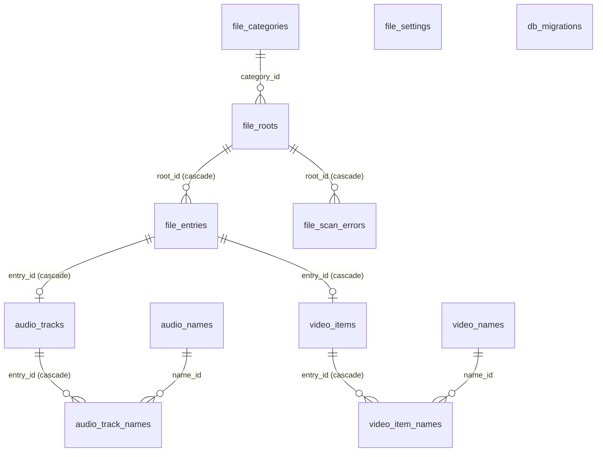

# hoardor database design

The one place that describes **every table in hoardor's SQLite database**: what each column means, the indexes and the queries they serve, the migrations, and the rules for changing any of it. Feature docs propose schema changes. Once a change is built, this file is updated to match, in the same change (the Definition of done in `CLAUDE.md`).

- **Mechanics** (connections, pragmas, statements, transactions, the migration runner) are in `engines/db.md`.
- **Why one database, and who owns which tables:** `ARCHITECTURE.md` §3.

Status: `v0.2.0` (Media library v1): file migrations 1–3, audio migrations 1–2, video migrations 1–3.

## 1. Rules

- **One file:** `library.db` on internal storage, never on a media drive. TYLI keeps it in its app-data folder.
- **SQLite build:** the amalgamation with `SQLITE_DQS=0`, `SQLITE_DEFAULT_MEMSTATUS=0`, `SQLITE_OMIT_LOAD_EXTENSION`, `SQLITE_ENABLE_FTS5`.
- **Pragmas** (set by `db::Database::open`):
  - `journal_mode=WAL` and `synchronous=NORMAL` (file databases)
  - `foreign_keys=ON`
  - a `busy_timeout` of 5 s
- **Ownership:** every table belongs to one engine and carries its prefix (`file_`, later `audio_`, `video_`, …). Only that engine's code writes it.
- **Cross-engine links and joins:**
  - Another engine's rows may reference it by id, with a foreign key: `audio_tracks.entry_id → file_entries.id ON DELETE CASCADE`.
  - Read-only joins on documented columns are allowed. That's why there's one database (ARCHITECTURE §3).
  - Each allowed join is listed in its table's section.
- **Migrations:**
  - **Per engine and append-only:** each engine has an ordered list of `db::Migration{version, sql}` (the "component" is the engine's name).
  - **Tracking:** `db_migrations` records each component's applied version.
  - **Execution:** each migration runs once, in its own transaction.
  - **Never edit a shipped migration.** Changes go in a new one.
- **Paths:** UTF-8, `/` separators, relative to their root.
- **Times:** `*_ns` columns are nanoseconds since the Unix epoch (UTC).
- **Booleans:** `INTEGER` 0 or 1.
- **Enums:** stored as their C++ integer values, which must never be renumbered (`FileKind`, `RootStatus`).
- **Lists:** stored as text. Short lists in configuration rows are comma-separated (`kinds`) or newline-separated (settings). Data that is queried by element gets its own table instead.
- **Ids:** `INTEGER PRIMARY KEY` (SQLite's rowid), never reused while the row exists. An entry keeps its id across syncs, renames of case on case-insensitive drives, and relocations of its root. Future per-file data, such as play counts, hangs off it.
- **No unbounded reads:** every list query is paged, by keyset (`WHERE id > ? … LIMIT ?`), never `OFFSET` (ARCHITECTURE §4).

## 2. Overview

| Table | Owner | Rows | Purpose |
|---|---|---|---|
| `db_migrations` | `db` | one per engine | applied migration version per component |
| `file_settings` | `file` | one per setting | the user's values for `file::Settings` |
| `file_categories` | `file` | a handful | library sections (Music, Movies, …) |
| `file_roots` | `file` | one per added folder | folders the user assigned to categories |
| `file_entries` | `file` | **one per media file** (the big one, 500k tested) | what sync found: path, size, mtime, kind |
| `file_scan_errors` | `file` | a few per root | what the last sync of a root couldn't read |
| `audio_tracks` | `audio` | one per audio file read | tags and stream info, with sort keys |
| `audio_names` | `audio` | one per artist or genre | each name once (identity: its sort key) |
| `audio_track_names` | `audio` | a few per track | a track's artists and genres |
| `video_items` | `video` | one per video file read | movie or episode: descriptions, streams, poster |
| `video_names` | `video` | one per genre or person | each name once |
| `video_item_names` | `video` | a few per item | an item's genres, directors, writers (with a role) |

## 3. Tables

### `db_migrations`

| Column | Type | Meaning |
|---|---|---|
| `component` | TEXT PK | engine name, e.g. `file` |
| `version` | INTEGER | the highest applied migration |

### `file_settings`

| Column | Type | Meaning |
|---|---|---|
| `key` | TEXT PK | setting name |
| `value` | TEXT | its serialized value |

- **Keys:**
  - `extension_kinds` (lines of `ext=kind`)
  - `ignored_names`, `ignored_prefixes` (lines)
  - `sync_on_startup` (`true`/`false`)
  - `settle_window_seconds`, `mass_removal_threshold_percent`
  - `batch_max_rows`, `batch_max_milliseconds`
  - `progress_interval_files`
  - `relocation_sample_size`, `relocation_min_match_percent`
  - `parallel_devices`
- **A missing or unparsable value** falls back to the default in code (`Settings::defaults()`). Saving validates against `file::limits` first.

### `file_categories`

| Column | Type | Meaning |
|---|---|---|
| `id` | INTEGER PK | |
| `name` | TEXT UNIQUE NOCASE | shown in the sidebar |
| `kinds` | TEXT | accepted `FileKind`s, comma-separated names (`audio,image`) |

Seeded by migration 1, all editable and deletable:
- Music: `audio,image`
- Movies: `video,subtitle,image`, plus `info` since migration 2
- Shows: `video,subtitle,image`, plus `info` since migration 2
- Books: `text,image`, removed again by migration 3 when untouched (same kinds, no folders), since text has no build yet (the user, 2026-10-03)

A category with roots can't be deleted (`InUse`).

### `file_roots`

| Column | Type | Meaning |
|---|---|---|
| `id` | INTEGER PK | |
| `uuid` | TEXT UNIQUE | identity, also written into the `.hoardor-root` marker |
| `category_id` | INTEGER → `file_categories` | |
| `name` | TEXT | shown name ("music (e:)") |
| `path` | TEXT | last-known absolute path (a hint, not the identity) |
| `path_in_volume` | TEXT | the same folder relative to its mount point ("" = whole volume), used to find it again under a new drive letter |
| `use_marker` | INTEGER | 1 if a marker file identifies it |
| `case_sensitive` | INTEGER | detected when added; decides `path_key` |
| `status` | INTEGER | `RootStatus`: 0 unknown, 1 online, 2 offline |
| `generation` | INTEGER | the last completed sync (0 = never synced) |
| `last_sync_ns` | INTEGER | when that sync finished |
| `file_count` | INTEGER | entries after that sync |
| `held_removals` | INTEGER | removals the mass-removal guard is holding |

### `file_entries`

| Column | Type | Meaning |
|---|---|---|
| `id` | INTEGER PK | stable file id |
| `root_id` | INTEGER → `file_roots` ON DELETE CASCADE | |
| `relative_path` | TEXT | exact name from disk, used to open the file |
| `path_key` | TEXT | `relative_path`, ASCII-lowercased on case-insensitive roots; with `root_id` the identity |
| `size` | INTEGER | bytes |
| `mtime_ns` | INTEGER | modification time |
| `kind` | INTEGER | `FileKind`: 1 audio, 2 video, 3 text, 4 image, 5 subtitle, 6 info (`.nfo`) |
| `unsettled` | INTEGER | 1 if modified within the settle window (probably still copying); metadata engines skip it |
| `seen_generation` | INTEGER | the last sync that saw it (mark and sweep: older rows are removed files) |
| `changed_generation` | INTEGER | the last sync that added or changed it |
| `added_ns` | INTEGER | when a sync first inserted it (the sync's start time); never changed by modifications. Entries from before migration 2 got their `mtime_ns` (file migration 2) |

- `UNIQUE (root_id, path_key)`: the sync's lookup, and its fast path for unchanged files.
- `INDEX file_entries_changed (root_id, changed_generation, id)`: `changed_entries`, where consumers page what one sync added or changed.
- `INDEX file_entries_added (added_ns, id)`: "added" ordering for the audio and video queries.
- `companions(entry)`: range scan of `(root_id, path_key)` over the folder's prefix, so it needs no extra index. With name prefixes (videos), one range scan per prefix (`folder/poster.` … `folder/poster.\xF4\x90`), so a folder of thousands of sidecars costs a few index seeks.
- `entries(root, after, limit)` pages by `(root_id, id)` through the rowid.

### `file_scan_errors`

| Column | Type | Meaning |
|---|---|---|
| `root_id` | INTEGER → `file_roots` ON DELETE CASCADE | |
| `relative_path` | TEXT | "" = the whole root was lost mid-sync |
| `is_directory` | INTEGER | 1: a whole subtree is unknown (its entries are kept) |
| `message` | TEXT | plain words |
| `generation` | INTEGER | the sync that recorded it |

- `INDEX file_scan_errors_root (root_id, generation)`. Each sync deletes the rows of older generations.

### `audio_tracks`

| Column | Type | Meaning |
|---|---|---|
| `entry_id` | INTEGER PK → `file_entries` ON DELETE CASCADE | the file |
| `source_size`, `source_mtime_ns` | INTEGER | the entry's size and mtime when read; different from the entry's now = stale, read again |
| `read_error` | TEXT | "" or why the file couldn't be read (such rows are left out of every query) |
| `title`, `album`, `album_artist` | TEXT | as tagged (or the fallbacks: file name, folder name, first artist / "Unknown artist") |
| `title_key`, `album_key`, `album_artist_key` | TEXT | `core::sort_key` of the sort tag or the value |
| `title_from_name`, `album_from_name` | INTEGER | 1 when the fallback was used |
| `artist`, `genre` | TEXT | all values, one per line (display); the identity is in `audio_track_names` |
| `artist_key` | TEXT | the first artist's sort key (ordering by artist) |
| `track`, `track_total`, `disc`, `disc_total` | INTEGER | 0 = not tagged |
| `date` / `year` | TEXT / INTEGER | as tagged / its year (0 = none) |
| `duration_ms`, `bitrate_kbps`, `sample_rate`, `bit_depth`, `channels` | INTEGER | stream info; `bit_depth` 0 for lossy codecs |
| `codec` | TEXT | ffmpeg's codec name |
| `lossless`, `has_embedded_cover` | INTEGER | |

- **Indexes:**
  - `audio_tracks_album (album_artist_key, album_key, disc, track)`: albums by artist then name, and an album's tracks
  - `audio_tracks_album_title (album_key, album_artist_key)`: albums by name
  - `audio_tracks_year (year, album_artist_key, album_key)`: a year's albums
  - `audio_tracks_title (title_key)`: tracks by title
- **Query hint:** the album groupings name their index (`INDEXED BY`) when ordered by their values and filtered only broadly. SQLite treats `GROUP BY` columns as a set and would otherwise stream from whichever matching index was created last, then sort every group.
- **Read-only joins:**
  - `file_entries` (`root_id`, `added_ns`, `size`, `kind`, `unsettled`, `mtime_ns`, `relative_path` for pending work)
  - `file_roots` (`category_id`, `status`)

### `audio_names` / `audio_track_names`

| Table | Columns |
|---|---|
| `audio_names` | `id` PK, `kind` (1 artist, 2 genre), `name` (as first seen), `key` (sort key); `UNIQUE (kind, key)`, so "Soul" and "soul" are one genre |
| `audio_track_names` | `entry_id` → `audio_tracks` ON DELETE CASCADE, `name_id` → `audio_names`, `position` (tag order); PK `(entry_id, name_id)`, WITHOUT ROWID; index `(name_id, entry_id)` |

Names no track uses are deleted at the end of each metadata pass (`remove_unused_names`). A filter on a name joins one link row: `name_id = (SELECT id … WHERE kind = ? AND key = ?)`.

### `audio_search` (FTS5)

`CREATE VIRTUAL TABLE audio_search USING fts5(title, album, album_artist, artists, genres, tokenize = 'unicode61 remove_diacritics 2')`, rowid = `audio_tracks.entry_id`.
- **Kept current by triggers** on `audio_tracks`: `audio_search_insert` (readable rows only), `audio_search_update`, `audio_search_delete`. Foreign-key cascades fire them too.
- **Queried by `Field::Search`:** `t.entry_id IN (SELECT rowid FROM audio_search WHERE audio_search MATCH ?)`, with every word a quoted prefix.
- **Build requirement:** SQLite compiled with `SQLITE_ENABLE_FTS5`.

### `video_items`

| Column | Type | Meaning |
|---|---|---|
| `entry_id` | INTEGER PK → `file_entries` ON DELETE CASCADE | |
| `source_size`, `source_mtime_ns`, `read_error` | | as in `audio_tracks` |
| `type` | INTEGER | `video::Type`: 1 movie, 2 episode |
| `title` / `title_key` | TEXT | the movie's or episode's title / its sort key |
| `show` / `show_key` | TEXT | episodes |
| `season`, `episode` | INTEGER | -1 / 0 = unknown; season 0 = specials |
| `year`, `date`, `plot` | | |
| `genre`, `director` | TEXT | display lists, one per line |
| `duration_ms`, `width`, `height`, `frame_rate_milli` | INTEGER | |
| `hdr`, `video_codec` | TEXT | "", "HDR10", "HLG", "Dolby Vision" / ffmpeg's codec name |
| `audio_streams`, `subtitle_streams` | TEXT | one stream per line: `language\tcodec\tchannels\ttitle` |
| `source`, `from_name` | INTEGER | `video::Source` (1 name, 2 tags, 3 nfo); 1 if the title came from the file name |
| `poster_entry` | INTEGER | a companion image's `file_entries.id` (0: none); read through a `LEFT JOIN`, so a removed image reads as 0 |
| `embedded_poster` | INTEGER | the file holds a poster |

- **Indexes:**
  - `video_items_title (type, title_key, year)`: movies (one card per title and year)
  - `video_items_show (type, show_key, season, episode)`: shows, seasons, episodes
  - `video_items_year (year)`
- **Read-only joins:** as for audio, plus `file_entries` again as `p` (the poster).

### `video_names` / `video_item_names`

| Table | Columns |
|---|---|
| `video_names` | `id` PK, `kind` (1 genre, 2 person), `name`, `key`; `UNIQUE (kind, key)` |
| `video_item_names` | `entry_id` → `video_items` ON DELETE CASCADE, `name_id` → `video_names`, `role` (1 genre, 2 director, 3 writer), `position`; PK `(entry_id, name_id, role)`, WITHOUT ROWID; index `(name_id, role, entry_id)` |

### `video_search` (FTS5)

`fts5(title, show, genres, directors, tokenize = 'unicode61 remove_diacritics 2')`, rowid = `video_items.entry_id`. It has the same three triggers on `video_items` (`video_search_insert`, `video_search_update`, `video_search_delete`).

## 4. Migration history

| Component | Version | Shipped in | Change |
|---|---|---|---|
| `file` | 1 | `v0.1.0` | All `file_*` tables above and the four seeded categories |
| `file` | 2 | `v0.2.0` | `file_entries.added_ns` (backfilled from `mtime_ns`) and its index; `info` added to the Movies and Shows categories; `nfo=info` appended to a saved extension map that doesn't map `.nfo` yet |
| `audio` | 1 | `v0.2.0` | `audio_tracks`, `audio_names`, `audio_track_names` and their indexes |
| `video` | 1 | `v0.2.0` | `video_items`, `video_names`, `video_item_names` and their indexes |
| `audio` | 2 | `v0.2.0` | `audio_search` FTS5 table (backfilled) and its three triggers |
| `video` | 2 | `v0.2.0` | `video_search` FTS5 table (backfilled) and its three triggers |
| `file` | 3 | `v0.2.0` | Deletes the seeded Books category if it's untouched: name `Books`, kinds `text,image`, and no roots. One with folders or changed kinds stays (2026-10-03) |
| `video` | 3 | `v0.2.0` | `UPDATE video_items SET source_size = -1`: every video is read once more, because companions used to stop at the first 200 files of a folder and most movies in a big shared folder lost their poster and `.nfo` (2026-10-03). The rows stay listed until re-read |

## 5. Proposed (not built)

Nothing at the moment. A feature doc that changes the schema lists its tables here until they're built.
