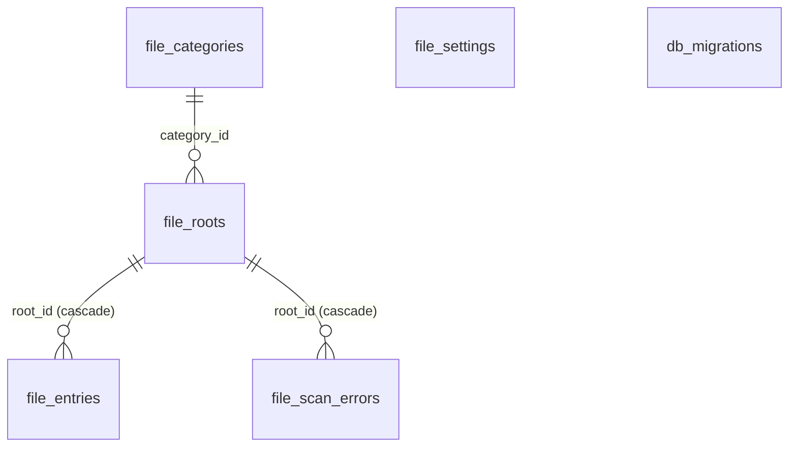

# hoardor database design

The one place that describes **every table in hoardor's SQLite database**: what each column means, the indexes and the queries they serve, the migrations, and the rules for changing any of it. Feature docs propose schema changes. Once a change is built, this file is updated to match, in the same change (the Definition of done in `CLAUDE.md`).

- **Mechanics** (connections, pragmas, statements, transactions, the migration runner) are in `engines/db.md`.
- **Why one database, and who owns which tables:** `ARCHITECTURE.md` §3.

Status: `v0.1.0` (file migration 1), plus file migration 2 built on `abhinavp06/MEDIA_LISTING` (Media library v1, phase 1). The rest of `features/media_listing.md` is listed in §5 until it's built.

## 1. Rules

- **One file:** `library.db` on internal storage, never on a media drive. TYLI keeps it in its app-data folder.
- **Pragmas** (set by `db::Database::open`):
  - `journal_mode=WAL` and `synchronous=NORMAL` (file databases)
  - `foreign_keys=ON`
  - a `busy_timeout` of 5 s
- **Ownership:** every table belongs to one engine and carries its prefix (`file_`, later `audio_`, `video_`, …). Only that engine's code writes it.
- **Cross-engine links and joins:**
  - Another engine's rows may reference it by id, with a foreign key: `audio_tracks.entry_id → file_entries.id ON DELETE CASCADE`.
  - Read-only joins on documented columns are allowed. That's why there's one database (ARCHITECTURE §3).
  - Each allowed join is listed in its table's section.
- **Migrations:**
  - **Per engine and append-only:** each engine has an ordered list of `db::Migration{version, sql}` (the "component" is the engine's name).
  - **Tracking:** `db_migrations` records each component's applied version.
  - **Execution:** each migration runs once, in its own transaction.
  - **Never edit a shipped migration.** Changes go in a new one.
- **Paths:** UTF-8, `/` separators, relative to their root.
- **Times:** `*_ns` columns are nanoseconds since the Unix epoch (UTC).
- **Booleans:** `INTEGER` 0 or 1.
- **Enums:** stored as their C++ integer values, which must never be renumbered (`FileKind`, `RootStatus`).
- **Lists:** stored as text. Short lists in configuration rows are comma-separated (`kinds`) or newline-separated (settings). Data that is queried by element gets its own table instead.
- **Ids:** `INTEGER PRIMARY KEY` (SQLite's rowid), never reused while the row exists. An entry keeps its id across syncs, renames of case on case-insensitive drives, and relocations of its root. Future per-file data, such as play counts, hangs off it.
- **No unbounded reads:** every list query is paged, by keyset (`WHERE id > ? … LIMIT ?`), never `OFFSET` (ARCHITECTURE §4).

## 2. Overview (`v0.1.0`)

| Table | Owner | Rows | Purpose |
|---|---|---|---|
| `db_migrations` | `db` | one per engine | applied migration version per component |
| `file_settings` | `file` | one per setting | the user's values for `file::Settings` |
| `file_categories` | `file` | a handful | library sections (Music, Movies, …) |
| `file_roots` | `file` | one per added folder | folders the user assigned to categories |
| `file_entries` | `file` | **one per media file** (the big one, 500k tested) | what sync found: path, size, mtime, kind |
| `file_scan_errors` | `file` | a few per root | what the last sync of a root couldn't read |

## 3. Tables

### `db_migrations`

| Column | Type | Meaning |
|---|---|---|
| `component` | TEXT PK | engine name, e.g. `file` |
| `version` | INTEGER | the highest applied migration |

### `file_settings`

| Column | Type | Meaning |
|---|---|---|
| `key` | TEXT PK | setting name |
| `value` | TEXT | its serialized value |

- **Keys:**
  - `extension_kinds` (lines of `ext=kind`)
  - `ignored_names`, `ignored_prefixes` (lines)
  - `sync_on_startup` (`true`/`false`)
  - `settle_window_seconds`, `mass_removal_threshold_percent`
  - `batch_max_rows`, `batch_max_milliseconds`
  - `progress_interval_files`
  - `relocation_sample_size`, `relocation_min_match_percent`
- **A missing or unparsable value** falls back to the default in code (`Settings::defaults()`). Saving validates against `file::limits` first.

### `file_categories`

| Column | Type | Meaning |
|---|---|---|
| `id` | INTEGER PK | |
| `name` | TEXT UNIQUE NOCASE | shown in the sidebar |
| `kinds` | TEXT | accepted `FileKind`s, comma-separated names (`audio,image`) |

Seeded by migration 1, all editable and deletable:
- Music: `audio,image`
- Movies: `video,subtitle,image`, plus `info` since migration 2
- Shows: `video,subtitle,image`, plus `info` since migration 2
- Books: `text,image`

A category with roots can't be deleted (`InUse`).

### `file_roots`

| Column | Type | Meaning |
|---|---|---|
| `id` | INTEGER PK | |
| `uuid` | TEXT UNIQUE | identity, also written into the `.hoardor-root` marker |
| `category_id` | INTEGER → `file_categories` | |
| `name` | TEXT | shown name ("music (e:)") |
| `path` | TEXT | last-known absolute path (a hint, not the identity) |
| `path_in_volume` | TEXT | the same folder relative to its mount point ("" = whole volume), used to find it again under a new drive letter |
| `use_marker` | INTEGER | 1 if a marker file identifies it |
| `case_sensitive` | INTEGER | detected when added; decides `path_key` |
| `status` | INTEGER | `RootStatus`: 0 unknown, 1 online, 2 offline |
| `generation` | INTEGER | the last completed sync (0 = never synced) |
| `last_sync_ns` | INTEGER | when that sync finished |
| `file_count` | INTEGER | entries after that sync |
| `held_removals` | INTEGER | removals the mass-removal guard is holding |

### `file_entries`

| Column | Type | Meaning |
|---|---|---|
| `id` | INTEGER PK | stable file id |
| `root_id` | INTEGER → `file_roots` ON DELETE CASCADE | |
| `relative_path` | TEXT | exact name from disk, used to open the file |
| `path_key` | TEXT | `relative_path`, ASCII-lowercased on case-insensitive roots; with `root_id` the identity |
| `size` | INTEGER | bytes |
| `mtime_ns` | INTEGER | modification time |
| `kind` | INTEGER | `FileKind`: 1 audio, 2 video, 3 text, 4 image, 5 subtitle, 6 info (`.nfo`) |
| `unsettled` | INTEGER | 1 if modified within the settle window (probably still copying); metadata engines skip it |
| `seen_generation` | INTEGER | the last sync that saw it (mark and sweep: older rows are removed files) |
| `changed_generation` | INTEGER | the last sync that added or changed it |
| `added_ns` | INTEGER | when a sync first inserted it (the sync's start time); never changed by modifications. Entries from before migration 2 got their `mtime_ns` (file migration 2) |

- `UNIQUE (root_id, path_key)`: the sync's lookup, and its fast path for unchanged files.
- `INDEX file_entries_changed (root_id, changed_generation, id)`: `changed_entries`, where consumers page what one sync added or changed.
- `INDEX file_entries_added (added_ns, id)`: "added" ordering for the audio and video queries.
- `companions(entry)`: range scan of `(root_id, path_key)` over the folder's prefix, so it needs no extra index.
- `entries(root, after, limit)` pages by `(root_id, id)` through the rowid.

### `file_scan_errors`

| Column | Type | Meaning |
|---|---|---|
| `root_id` | INTEGER → `file_roots` ON DELETE CASCADE | |
| `relative_path` | TEXT | "" = the whole root was lost mid-sync |
| `is_directory` | INTEGER | 1: a whole subtree is unknown (its entries are kept) |
| `message` | TEXT | plain words |
| `generation` | INTEGER | the sync that recorded it |

- `INDEX file_scan_errors_root (root_id, generation)`. Each sync deletes the rows of older generations.

## 4. Migration history

| Component | Version | Shipped in | Change |
|---|---|---|---|
| `file` | 1 | `v0.1.0` | All `file_*` tables above and the four seeded categories |
| `file` | 2 | (v0.2.0, Media library v1) | `file_entries.added_ns` (backfilled from `mtime_ns`) and its index; `info` added to the Movies and Shows categories; `nfo=info` appended to a saved extension map that doesn't map `.nfo` yet |

## 5. Proposed (not built)

These changes stay here until they're built, then move into §2–§4.

- **`features/media_listing.md` §6** (Media library v1, draft v2, awaiting approval):
  - **`audio` migration 1:**
    - `audio_tracks`: one row per audio entry, holding tags, stream info, sort keys, and the source size and mtime that detect stale rows
    - `audio_names`: each artist or genre once
    - `audio_track_names`: a track's many artists and genres
  - **`video` migration 1:** `video_items`, `video_names`, and `video_item_names` (genres, directors, writers, actors).
  - **Read-only joins** from `audio_*` and `video_*` queries:
    - `file_entries`: `root_id`, `added_ns`, `size`, `unsettled`
    - `file_roots`: `category_id`, `status`
